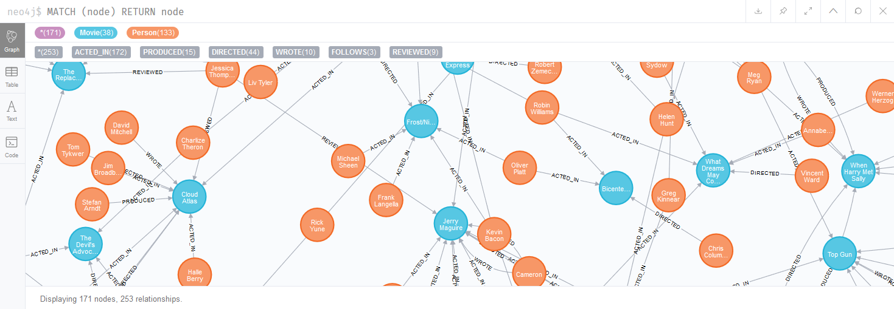

# Atividade 2 - Pós DataScience - NoSQL - NEO4J

1. ativar o ambiente
```
# docker-compose up neo4j-server
```

use a flag -d se quiser que rode em segundo plano.

Foi retirada a senha através da variável de ambiente no _docker-compose.yaml_ para testes facilitados.

Verificando a documentação de apoio, assume-se que deve ser usada a informação _:play movie-graph_ como modelo de dados para os exercícios.


## Exercício 1- Retrieving Nodes 

1. Retrieve all nodes from the database.
```
$ MATCH (node) RETURN node
```

2. Examine the data model for the graph.


3. Retrieve all Person nodes.
```
$ MATCH (node:Person) RETURN node
```

4. Retrieve all Movie nodes. 
```
$ MATCH (node:Movie) RETURN node
```


## Exercício 2 – Filtering queries using property values 

1. Retrieve all movies that were released in a specific year.
```
$ MATCH (node:Movie {released: 1999}) RETURN node
```

2. View the retrieved results as a table.


3. Query the database for all property keys.
```
$ CALL db.propertyKeys
```

4. Retrieve all Movies released in a specific year, returning their titles.
```
$ MATCH (node:Movie {released: 1999}) RETURN node.title
```

5. Display title, released, and tagline values for every Movie node in the graph.
```
$ MATCH (node:Movie {released: 1999}) RETURN node.title, node.tagline, node.released
```

6. Display more user-friendly headers in the table
```
$ MATCH (node:Movie {released: 1999}) RETURN node.title AS `Título`, node.tagline AS `Subtítulo`, node.released AS `Lançado em`
```


## Exercício 3 - Filtering queries using relationships 

1. Display the schema of the database.
```
$ CALL db.schema.visualization()
```

2. Retrieve all people who wrote the movie Speed Racer.
```
$ MATCH (p:Person)-[rel:WROTE]->(m:Movie {title: 'Speed Racer'}) RETURN p, rel, m
```

3. Retrieve all movies that are connected to the person, Tom Hanks.
```
$ MATCH (p:Person {name: 'Tom Hanks'})-[rel]->(m:Movie) RETURN p, rel, m
```

4. Retrieve information about the relationships Tom Hanks had with the set of movies retrieved earlier.
```
$ MATCH (p:Person {name: 'Tom Hanks'})-[rel]->(m:Movie) RETURN p.name, type(rel), m.title
```

5. Retrieve information about the roles that Tom Hanks acted in. 
```
$ MATCH (p:Person {name: 'Tom Hanks'})-[rel:ACTED_IN]->(m:Movie) RETURN p.name, type(rel), m.title
```


## Exercício 4 – Filtering queries using WHERE clause 

1. Retrieve all movies that Tom Cruise acted in. 
```
$ MATCH (p:Person {name: 'Tom Cruise'})-[r:ACTED_IN]->(m:Movie) RETURN p, r, m
```

2. Retrieve all people that were born in the 70’s. 
```
$ MATCH (p:Person) WHERE 1970 <= p.born <= 1979 RETURN p
```

3. Retrieve the actors who acted in the movie The Matrix who were born after 1960. 
```
$ MATCH (p:Person)-[r:ACTED_IN]->(m:Movie {title: 'The Matrix'}) WHERE p.born >= 1960 RETURN p, r, m
```

4. Retrieve all movies by testing the node label and a property. 
```
$ MATCH (m:Movie {released: 1999}) WHERE m.title STARTS WITH 'The ' RETURN m
```

5. Retrieve all people that wrote movies by testing the relationship between two nodes. 
```
$ MATCH (p:Person)-[r]->(m:Movie) WHERE type(r) = 'WROTE' RETURN p, r, m
```

6. Retrieve all people in the graph that do not have a property. 
```
$ MATCH (p:Person) WHERE NOT exists(p.city) RETURN p
```

7. Retrieve all people related to movies where the relationship has a property. 
```
$ MATCH (p:Person)-[r]->(m:Movie) WHERE exists(r.rating) RETURN p
```

8. Retrieve all actors whose name begins with James. 
```
$ MATCH (p:Person)-[r]->(m:Movie) WHERE p.name STARTS WITH 'James' RETURN p
```

9. Retrieve all all REVIEW relationships from the graph with filtered results. 
```
$ MATCH (p:Person)-[r]->(m:Movie) WHERE type(r) = 'REVIEWED' RETURN r
```

10. Retrieve all people who have produced a movie, but have not directed a movie. 
```
$ MATCH (p:Person)-[r:PRODUCED]->(m:Movie) WHERE NOT exists( (p)-[:DIRECTED]->(m) ) RETURN p
```

11. Retrieve the movies and their actors where one of the actors also directed the movie. 
```
$ MATCH (p:Person)-[r:ACTED_IN]->(m:Movie) WHERE exists( (p)-[:DIRECTED]->(m) ) RETURN p, r, m
```

12. Retrieve all movies that were released in a set of years. 
```
$ MATCH (m:Movie) WHERE m.released in [1999,1990] RETURN m
```

13. Retrieve the movies that have an actor’s role that is the name of the movie. 
```
$ MATCH (p:Person)-[r:ACTED_IN]->(m:Movie) WHERE m.title in r.roles RETURN p, r, m
```


## Exercício 5 – Controlling query processing 

1. Retrieve data using multiple MATCH patterns. 
```
$ MATCH (a:Person)-[:ACTED_IN]->(m:Movie),
	(m:Movie)<-[:DIRECTED]-(d:Person) 
RETURN a.name, m.title, d.name
```

2. Retrieve particular nodes that have a relationship. 
```
$ MATCH (a:Movie), (p:Person) WHERE exists((p)--(a)) RETURN a, p
```

3. Modify the query to retrieve nodes that are exactly three hops away. 
```
$ MATCH p = (a:Person)-[*3]->(b:Movie) RETURN p
```

4. Modify the query to retrieve nodes that are one and two hops away. 
```
$ MATCH p = (a:Person)-[*1..2]->(b:Movie) RETURN p
```

5. Modify the query to retrieve particular nodes that are connected no matter how many hops are required. 
```
$ MATCH p = shortestPath((a:Person {name:'Keanu Reeves'})-[*]-(b:Person {name:'Natalie Portman'})) RETURN p
```

6. Specify optional data to be retrieved during the query. 
```
$ MATCH p = shortestPath((a:Person {name:'Keanu Reeves'})-[*]-(b:Person {name:'Natalie Portman'})) 
OPTIONAL MATCH (a)-[r:ACTED_IN]->(m:Movie)
RETURN p, m
```

7. Retrieve nodes by collecting a list. 
```
$ MATCH (p:Person)-[:ACTED_IN]->(m:Movie) WHERE p.name ='Keanu Reeves' RETURN collect(m.title)
```

Obs.: Não tinha questão 8 no documento de atividades.

9. Retrieve nodes as lists and return data associated with the corresponding lists.
```
$ MATCH (p:Person)-[:ACTED_IN]->(m:Movie) WHERE p.name STARTS WITH 'K' RETURN p.name, collect(m.title)
```

10. Retrieve nodes and their relationships as lists. 
```
$ MATCH (p:Person)-[r:ACTED_IN]->(m:Movie) WHERE p.name STARTS WITH 'K' RETURN p.title, collect(m.title), collect(r.roles)
```

11. Retrieve the actors who have acted in exactly five movies. 
```
$ MATCH (a:Person)-[:ACTED_IN]->(m:Movie) 
WITH  a, count(a) AS numMovies, collect(m.title) as movies 
WHERE numMovies = 5
RETURN a.name, numMovies, movies
```

12. Retrieve the movies that have at least 2 directors with other optional data. 
```
$ MATCH (a:Person)-[:DIRECTED]->(m:Movie) 
WITH  m, count(m) AS numDirectors, collect(a.name) as directors
WHERE numDirectors >= 2
RETURN m.title, numDirectors, directors
```


## Exercício 6 – Controlling results returned 

1. Execute a query that returns duplicate records. 
```
$ MATCH (a:Person)-[:DIRECTED]->(m:Movie) RETURN a.name
```

2. Modify the query to eliminate duplication. 
```
$ MATCH (a:Person)-[:DIRECTED]->(m:Movie) RETURN DISTINCT a.name
```

3. Modify the query to eliminate more duplication. 
```
$ MATCH (a:Person)-[:DIRECTED]->(m:Movie) WITH DISTINCT a RETURN a
```

4. Sort results returned. 
```
$ MATCH (a:Person)-[:DIRECTED]->(m:Movie) 
WITH DISTINCT a RETURN a ORDER BY a.name
```

5. Retrieve the top 5 ratings and their associated movies. 
```
$ MATCH (a:Person)-[r:REVIEWED]->(m:Movie)
RETURN m.title, r.rating ORDER BY r.rating DESC LIMIT 5
```

6. Retrieve all actors that have not appeared in more than 3 movies. 
```
$ MATCH (a:Person)-[r:ACTED_IN]->(m:Movie)
WITH a.name as actor, count(r) AS countAppearances, collect(m.title) as movies
WHERE countAppearances <= 3
RETURN actor, countAppearances, movies
ORDER BY countAppearances DESC
```


## Exercício 7 – Working with cypher data  

1. Collect and use lists. 
```
$ MATCH (a:Person)-[r:REVIEWED]->(m:Movie) 
WITH  a, count(m) AS numReviews, collect(m.title) as reviews, avg(r.rating) AS avgRating
RETURN a.name, reviews, numReviews, avgRating
ORDER BY size(reviews)
```

2. Collect a list. 
```
$ WITH ['a', 'e', 'i', 'o', 'u'] AS vogals RETURN collect(vogals)
```

3. Unwind a list. 
```
$ WITH ['a', 'e', 'i', 'o', 'u'] AS vogals
UNWIND vogals as vogal
RETURN vogal, vogals
```

4. Perform a calculation with the date type. 
```
$ MATCH (p:Person)-[:ACTED_IN]->(m:Movie) 
WHERE exists(p.born) 
  AND exists(m.released)
RETURN p.name, m.title, m.released - p.born as AgeInMovie, date().year - p.born as AgeToday
ORDER BY AgeInMovie
```


## Exercício 8 – Creating nodes 

1. Create a Movie node. 
```
$ CREATE (:Movie {title: 'Matrix 4'}) 
```

2. Retrieve the newly-created node. 
```
$ MATCH (m:Movie {title: 'Matrix 4'}) RETURN m
```

3. Create a Person node. 
```
$ CREATE (:Person {name: 'João', born:1983})
```

4. Retrieve the newly-created node. 
```
$ MATCH (p:Person {name: 'João'}) RETURN p
```

5. Add a label to a node. 
```
$ MATCH (p:Person {name: 'João'}) SET p:Male RETURN p
```

6. Retrieve the node using the new label. 
```
$ MATCH (p:Person:Male) RETURN p
```

7. Add the Female label to selected nodes. 
```
$ MATCH (p:Person) WHERE p.name STARTS WITH 'Di' SET p:Female RETURN p
```

8. Retrieve all Female nodes. 
```
$ MATCH (p:Person:Female) RETURN p
```

9. Remove the Female label from the nodes that have this label. 
```
$ MATCH (p:Person:Female) REMOVE p:Female RETURN p
```

10. View the current schema of the graph. 
```
$ CALL db.schema.visualization()
```

11. Add properties to a movie. 
```
$ MATCH (m:Movie {title: 'The Matrix'}) SET m.blockbuster = true RETURN m
```

12. Retrieve an OlderMovie node to confirm the label and properties. 
```
$ MATCH (m:Movie {title: 'The Matrix'}) RETURN m
```

13. Add properties to the person, Robin Wright. 
```
$ MATCH (x:Person {name: 'Keanu Reeves'}) SET x.sad = true RETURN x
```

14. Retrieve an updated Person node. 
```
$ MATCH (x:Person {name: 'Keanu Reeves'}) RETURN x
```

15. Remove a property from a Movie node.
```
$ MATCH (m:Movie {title: 'The Matrix'}) REMOVE m.blockbuster RETURN m
```

16. Retrieve the node to confirm that the property has been removed. 
Mesma resposta da 12.

17. Remove a property from a Person node. 
```
$ MATCH (x:Person {name: 'Keanu Reeves'}) REMOVE x.sad RETURN x
```

18. Retrieve the node to confirm that the property has been removed. 
Mesma resposta da 14.


## Exercício 9 – Creating relationships  

1. Create ACTED_IN relationships.
2. Create DIRECTED relationships. 
3. Create a HELPED relationship. 
4. Query nodes and new relationships. 
5. Add properties to relationships. 
6. Add a property to the HELPED relationship. 
7. View the current list of property keys in the graph. 
8. View the current schema of the graph. 
9. Retrieve the names and roles for actors. 
10. Retrieve information about any specific relationships.
11. Modify a property of a relationship. 
12. Remove a property from a relationship. 
13. Confirm that your modifications were made to the graph. 


## Exercício 10 – Deleting nodes and relationships  

1. Delete a relationship. 
2. Confirm that the relationship has been deleted.
3. Retrieve a movie and all of its relationships. 
4. Try deleting a node without detaching its relationships. 
5. Delete a Movie node, along with its relationships. 
6. Confirm that the Movie node has been deleted. 
